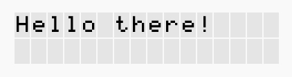
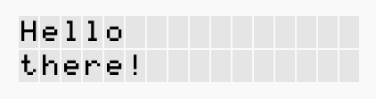
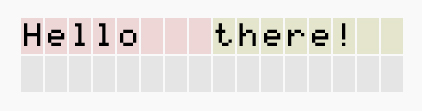

# Dots
A python module that facilitates the programming of 16x1 or 16x2 dor pattern
liquid crystal displays that use the HD44780 or a similar controller, by
providing an easy to use python interface to communicate with the display but
also greatly extending the capabilities of it. Briefly, you can:
* Display text on the LCD screen (duh)
* Have unlimited lines of text
* Split lines into unlimited cells and format cell widths using tab stops
* Scroll through all of the contents with ease and in many different ways
* Load extended dot patterns and draw them on the screen (coming soon)

## Prerequisities
This module makes use of the HD44780 module, found also in my rpi-ifc repo

## Installation
Just grab the files, put them in the same directory as your project and import
appropriately. Don't forget to also copy thi ifc folder that contains the
necessary dependency modules

## Usage
Connect your LCD to the RPi GPIO pins and initialize Dots using:
```python
# Define custom pins
pins = {
    # 'rw' pin not yet supported
    'rs':    21
    'e' :    22,
    'db':   [4, 25, 24, 23] }

# Pass them to Dots.init()
# Call this before any other Dots function
Dots.init( pins )
```
replacing the pin numbers according to your setup (using BCM pin numbering).
You can also call `Dots.init()` without any arguments and connect the LCD to the
default pins, as defined by the HD44780  module ([read the corerponding wiki
for more information][1])

*The sections that follow assume text is displayed on a dot pattern liquid
crystal display with 2 lines of text of 16 characters each (default for Dots)*

### Displaying text on the screen
You can display text on the screen calling the `display()` function:
```python
Dots.display("Hello there!")
```



To change line, simply use the `'\n'` character (line break) in your string:
```python
Dots.dipslay("Hello\nthere!")
```



Notice that each time you call display, the text on the screen is being
replaced with the new one.

To split a line into cells, use the `'\t'` character (tab stop) in your string:
```python
Dots.display("Hello\tthere!")
```



Dots automatically distributes the widths of the two cells (they are displayed
with different background color) to span the whole line on the screen.

## Versioning
#### version 0.7 (**current**)
An early stage of the module that allows to:
* Display text on the LCD screen
* Split the text into unlimited lines and lines into unlimited cells
* Format cell widths using tab stops
* Scroll the screen up and down, lines and cells left and right, once or
  every number of seconds

---

Author and Maintainer: [Ioannes Bracciano]

[Read the license]()


