# Dots
A python module that facilitates the programming of 16x1 or 16x2 dor pattern
liquid crystal displays that use the HD44780 or a similar controller, by
providing an easy to use python interface to communicate with the display but
also greatly extending the capabilities of it. Briefly, you can:
* Display text on the LCD screen (duh)
* Have unlimited lines of text
* Split lines into unlimited cells and format cell widths using tab stops
* Scroll through all of the contents with ease and in many different ways
* Load extended dot patterns and draw them on the screen (coming soon)

## Prerequisities
This module makes use of the pi's GPIO module, as well as the HD44780 module
that can also be found in my [rpi-ifc repo](https://github.com/IoannesBracciano/rpi-ifc).

## Installation
Just grab the files, put them in the same directory as your project and import
appropriately. Don't forget to also copy the ifc folder that contains the
necessary dependency modules

## Usage
Connect your LCD to the RPi GPIO pins and initialize Dots using:
```python
# Define custom pins
pins = {
    # 'rw' pin not yet supported
    'rs':    21
    'e' :    22,
    'db':   [4, 25, 24, 23] }

# Pass them to Dots.init()
# Call this before any other Dots function
Dots.init( pins )
```
replacing the pin numbers according to your setup (using BCM pin numbering).
You can also call `Dots.init()` without any arguments and connect the LCD to the
default pins, as defined by the HD44780  module ([read the wiki](https://github.com/IoannesBracciano/rpi-ifc/wiki/HD44780))

*The sections that follow assume text is displayed on a dot pattern liquid
crystal display with 2 lines of text of 16 characters each (default for Dots)*

### Displaying text on the screen
You can display text on the screen calling the `display()` function:

```python
Dots.display("Hello there!")
```
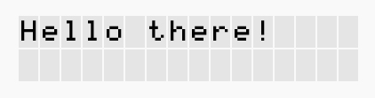

To change line, simply use the `'\n'` character (line break) in your string:

```python
Dots.dipslay("Hello\nthere!")
```
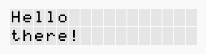

Notice that each time you call display, the text on the screen is being
replaced with the new one.

To split a line into cells, use the `'\t'` character (tab stop) in your string:

```python
Dots.display("Hello\tthere!")
```
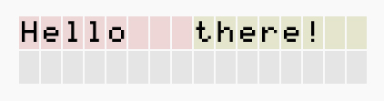

Dots automatically distributes the widths of the two cells (they are displayed
with different background color) to span the whole line on the screen.

### Formatting cells
Cell widths can be controlled by setting the tab stop positions. In the example
above, we've divided the line in two cells by introducing one tab stop ('\t').
We can reposition it by calling:

```python
Dots.set_tab_stops([10])
```
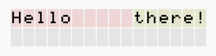

Now the first cell occupies 10 characters on the screen, while the second one
occupies the remaining 6 characters to the end of the line. If you have multiple
lines, setting tab stops this way will affect all of them:

```python
Dots.display("""
3\tDoukissis Plakentias\t  4'
3\tAirport\t 16'
""")

Dots.set_tab_stops([2,12])
```
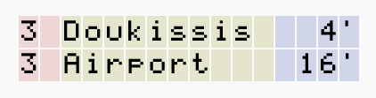

If you need to divide each line differently, you can do this by specifying an
array of arrays of tab stops for each line you display:

```python
Dots.display("""
3\tAirport\t 13'
3\tNon-stop
""")

Dots.set_tab_stops([ [2,12], [2] ])
```
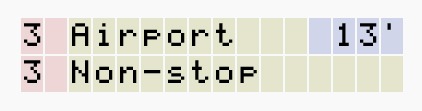

In this case it doesn't really matter the order in which you specify the inner
arrays, because Dots can assume that the 2-element array corresponds to the
line with two tab stops, while the 1-element array corresponds to the line with
one tab stop. You can also set the tab stop positions for specific lines only:

```python
Dots.display("""
3\tAirport\t 10'
Terminal
""")

Dots.line(0).set_tab_stops([2,12])
```
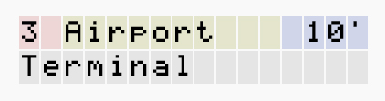

### Scrolling contents
Now your string spans more lines than the screen has. You can scroll through
them easily:

```python
Dots.display("""
On your back
with your racks
as he stacks
your load
""")
```
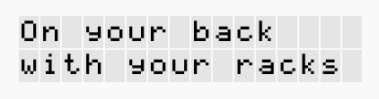
```python
Dots.scroll().down(2).once()
```
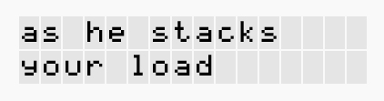

You may also `scroll().up()` a number of lines.

Similarly, to scroll the contents of a line cell by cell:

```python
Dots.display("Cells\tthat\tcarry\ton\tbeyond\tline")
Dots.set_tab_stops([6,11,16,19,28])
```
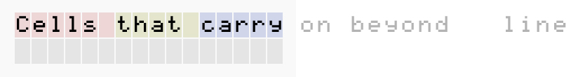

```python
Dots.scroll( Dots.line() ).left(3).once()
```
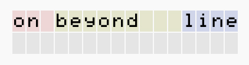

`Dots.line()`, when called without arguments, will always return the top most
line that is currently displayed on the screen (the current line).

Finally, consider the example of the train departures above:

```python
Dots.display("""
3\tDoukissis Plakentias\t  4'
3\tAirport\t 16'
""")

Dots.set_tab_stops([2,12])
```


The second cell of the first (and current) line contains some hidden content
that can be revealed by scrolling the cell to the left:

```python
# Get a reference to the cell
cell = Dots.line().cell(1)
#Scroll its contents left by 10 characters
Dots.scroll(cell).left(10).once()
```
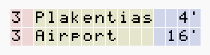

Instead of `once()` you can also call `every()` or `bounce()` at the end to
start an automated scrolling of the contents, specifying a time interval between
each scroll:

```python
# Will scroll the contents to the right by 1 character, every half second
# while obtaining a reference to the scroller
scroller = Dots.scroll(cell).right().every(0.5)
# The contents will scroll until they've reached the start,
# but you can stop the scrolling anytime by calling stop()
scroller.stop()
# You may later start the scrolling again
# Bounce will scroll the contents indefinitely, reversing the scrolling
# direction every time it hits a boundary (it bounces back and forth)
scroller.bounce(0.5)
```

## Contributing
You are welcome to fork the repository and apply your own cool ideas. I have
very, very little experience on testing, so anybody who wants to write a
robust testing suite for the library is more than welcome to do so! Lastly,
you can create an issue if you've used the library and stumbled upon a bug, or
if you want to suggest a feature to be implemented in the next versions.

## Versioning
#### version 0.7 (**current**)
An early stage of the module that allows to:
* Display text on the LCD screen
* Split the text into unlimited lines and lines into unlimited cells
* Format cell widths using tab stops
* Scroll the screen up and down, lines and cells left and right, once or
  every number of seconds

---

Author and Maintainer: [Ioannes Bracciano](mailto:john.bracciano@hotmail.gr)

[Read the license](LICENSE)


